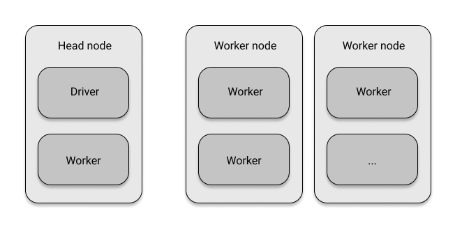

## **레이는 무엇인가?**

레이는 파이썬 데이터 과학 커뮤니티를 위해서 만든 분산 컴퓨팅 프레임워크이다. 핵심 API가 매우 간결하여 분산 프로그램을 효율적으로 작성 가능하다. 레이를 사용하면 파이썬 프로그램을 효율적으로 병렬화하고 로컬에서 테스트한 코드를 변경 없이 클러스터에서 실행하는 것이 가능하다.

레이의 코어는 C++로 개발되었으나 파이썬, 자바를 비롯한 여러 언어를 바인딩하도록 설계되어 있다.

### **레이의 디자인 철학**

레이의 API는 단순함과 일반성을 중심으로, 컴퓨팅 모델은 유연성을 목표로, 시스템 아키텍처는 성능과 확장성을 위해 설계 되었다.

#### **단순성과 추상화**

레이는 단순할 뿐만 아니라 직관적이다. 거기다 레이는 다른 훌륭한 분산 시스템과 같이 작업을 자체적으로 분배하고 조정한다. 분산 컴퓨팅 메커니즘에 대한 원리에 얽메일 필요가 없다. 즉, 좋은 추상화를 제공해준다.

#### **속도와 확장성**

레이는 초당 수백만 개의 작업을 처리하며 레이턴시가 매우 짧다. 또한 오토 스케일링을 제공하며 장애 복구도 빠르다.

#### **레이의 3가지 계층**

-   레이 코어 : 클러스터 배포를 위한 간결한 API 및 도구를 갖춘 파이썬용 분산 컴퓨팅 프레임워크
-   라이브러리 : 레이 개발진이 개발하고 관리하는 여러 하이레벨 라이브러리이다. 일반적인 머신러닝 워크로드에서 통합 API와 함께 라이브러리를 사용하기 위한 레이 AIR도 포함한다.
-   생태계 : 앞 두 계층의 다양한 영역에 걸쳐 있는 다른 주목할 만한 프로젝트와의 통합과 성장하는 파트너십 생태계가 포함된다.

## **분산 컴퓨팅 프레임워크**

레이는 본질적으로 분산 컴퓨팅 프레임워크이다. 즉, 분산 작업을 실행하도록 컴퓨터 클러스터를 설정하고 관리한다. 레이 클러스터는 서로 네트워크로 연결된 노드로 구성된다. 헤드 노드에 있는 드라이버나 프로그램 루트라고 불리는 도구로 프로그래밍한다. 드라이버는 클러스터의 노드에서 실행되는 태스크의 모임인 잡을 실행한다. 잡의 개별 태스크는 워커 노드의 워커 프로세스에서 실행된다.

레이 클러스터는 하나의 컴퓨터만 있는 로컬 클러스터여도 된다. 여기서는 드라이버 프로세스와 몇몇 워커 프로세스가 있는 헤드 노드만 있다. 워커 프로세스 수의 기본값은 CPU 수이다.



레이를 설치하는 명령어는 다음과 같다.

```
pip install "ray[rlib, serve, tune]==2.37.0"
```

## **데이터 과학 라이브러리**

### **데이터 과학 작업 흐름**

#### **데이터 처리**

머신러닝 모델을 훈련하려면 모델이 이해하는 형식의 데이터가 필요하다. 모델에 사용할 데이터를 변환하고 고르는 과정을 피처 엔지니어링이라고 부른다. **레이 데이터셋**

#### **하이퍼파라미터튜닝**

모델을 훈련할 때, 일부 파라미터를 조정해야 한다. 모델 훈련 전에 일부 파라미터를 수정해야 한다. 파라미터는 경우에 따라 머신러닝 모델의 성능에 큰 영향을 주므로 적절하게 조절해야 한다. **레이 튠**

#### **모델 훈련**

머신러닝 모델은 이전 단계에서 처리된 데이터를 바탕으로 알고리즘을 훈련한다. **레이 RLlib, 레이 트레인**

#### **모델 서빙**

훈련을 마친 모델은 배포해야 한다. 모델 서빙은 모델을 여러 방식으로 접근하도록 만드는 작업이다. 프로토타입에서는 간단하게 HTTP 서버를 사용하지만, 머신러닝 모델 서빙을 위한 소프트웨어가 많이 있다. **레이 서브**

정리하면, 레이 데이터셋을 사용해 데이터를 처리하고, 레이 트레인을 통해 분산 모델을 훈련하며, 레이 RLlib을 통해 강화학습 워크로드를 실행하고 레이 튠을 사용해 하이퍼파라미터튜닝을 하며, 레이 서브를 통해 모델을 서빙한다.