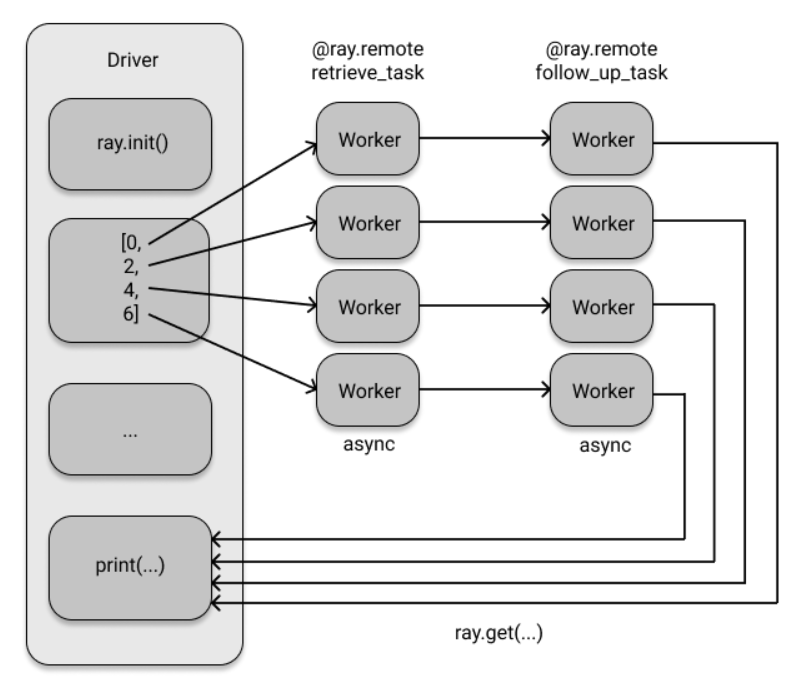
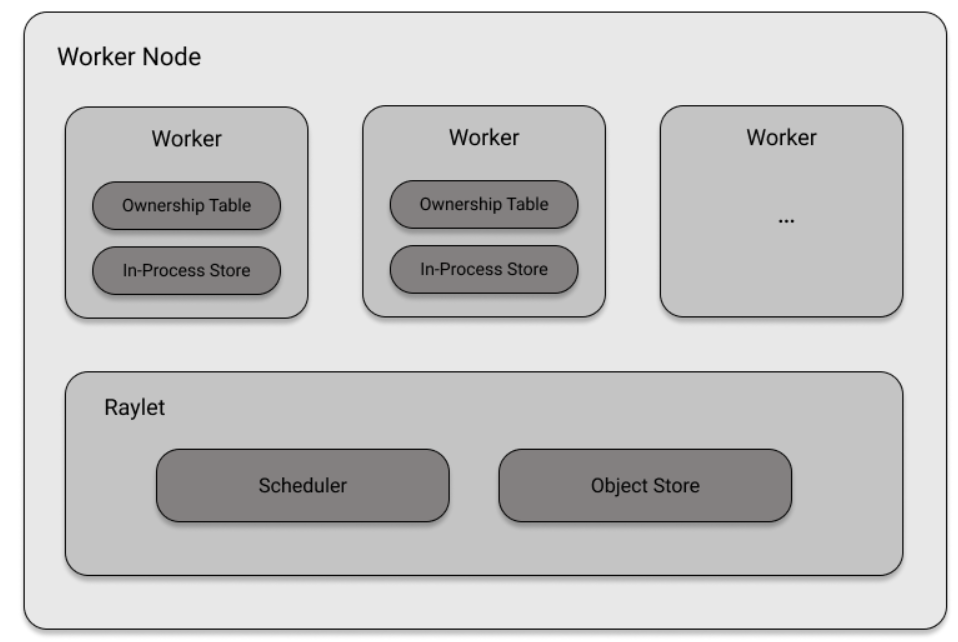

## **레이 코어**

파이썬 인터프리터는 사실상 싱글 스레드이다. 일반 파이썬을 사용하면 전체 클러스터 뿐만 아니라 동일한 시스템에서 여러 CPU를 활용하기도 어렵다.

파이썬 라이브러리로 제공되는 레이 코어 API는 모든 파이썬 커뮤니티에서 범용 분산 프로그래밍을 쉽게 다루는 강력한 도구이다. 레이는 쉽게 학습할 수 있게 하기 위해서 파이썬의 데코레이터, 함수, 클래스를 제공한다. 레이 코어 API의 목표는 분산 컴퓨팅을 위한 범용 프로그래밍 인터페이스의 제공이다. 

### **레이 API를 활용한 첫 번째 예시**

```
database = ["Learning", "Ray", "Flexible", "Distributed", "Python", "for", "Machine", "Learning"]

def retrieve(item):
    time.sleep(item / 10)
    return item, database[item]

def print_runtime(input_data, start_time):
    print(f'Runtime: {time.time() - start_time:.2f} seconds, data:')
    print(*input_data, sep="\n")


start = time.time()
data = [retrieve(item) for item in range(8)]
print_runtime(data, start)


"""
Runtime: 2.80 seconds, data:
(0, 'Learning')
(1, 'Ray')
(2, 'Flexible')
(3, 'Distributed')
(4, 'Python')
(5, 'for')
(6, 'Machine')
(7, 'Learning')
"""
```

반복문을 순회하면, 0 + 0.1 + 0.2 + ... 0.7 = 2.5초가 나올 것으로 예상했으나 2.8초가 나왔다. 중요한 사실은 순수 파이썬 구현으로 함수를 병렬적으로 실행할 수 없다는 것이다. 

#### **함수와 원격 레이 태스크**

병렬적으로 실행되었다면, 런타임은 최대 0.7초일 것이다. 레이를 사용해보자.

```
@ray.remote # 어떤 파이썬 함수이든 레이 태스크로 만든다
def retrieve_task(item):    # ray.remote를 붙이기 위해 만든 함수일 뿐임
    return retrieve(item)
```

이제 retrieve\_task 함수는 레이 태스크가 되어 호출된 프로세스가 아닌 다른 프로세스, 즉 다른 컴퓨터에서 실행되는 함수이다.

```
start = time.time()
object_references = [retrieve_task.remote(item) for item in range(8)] # remote()로 item을 레이 클러스터로 전달해 retrieve_task 함수를 실행한다. 각 태스크는 오브젝트를 반환한다.
data = ray.get(object_references)	# 레이 오브젝트 레퍼런스와 실제 데이터를 가져오기 위해서 ray.get을 사용한다
print_runtime(data, start)
```

remote()를 호출하여 원격으로 레이 태스크를 실행한다. 레이는 로컬 클러스터에서 원격으로 실행하더라도 병렬적이고, 비동기로 실행한다. 

object\_references에는 Object가 아닌 ObjectRef가 들어있다. 이 ObjectRef를 이용하여 결과를 얻기 위해 ray.get을 호출한다. 레이 태스크는 오브젝트 레퍼런스를 생성한다.

정리하면, 파이썬 함수에 @ray.remote 데코레이터를 적용하여 레이 태스크로 만들고, 원래 함수를 호출하는 방법 대신 remote를 사용하여 원격으로 레이 태스크를 실행하고, 결과를 얻기 위해 오브젝트 레퍼런스를 대상으로 ray.get을 실행한다.

위 실행 결과는 본인의 컴퓨터에서는 1.16초가 나왔다. ( 워커 프로세스의 기본값은 CPU의 수인데, 본인의 CPU는 8이기 때문으로 추정 )

#### **put과 get을 사용해 오브젝트 스토어 사용하기**

앞에서는 retrieve 함수를 사용해 데이터베이스의 아이템에 직접 접근했다. 로컬 레이 클러스터에서는 괜찮지만 여러 대의 컴퓨터가 있는 실제 클러스터에서 실행된다고 생각하면, 어떻게 모든 컴퓨터가 동일한 데이터에 접근할 수 있을까?

데이터베이스는 현재, 드라이버에만 들어있지만, 태스크를 실행하는 워커가 retrieve 태스크를 실행하려면 워커에서도 그 데이터베이스에 접근해야 한다. 다행히 레이는 드라이버와 워커가 오브젝트를 공유하는 쉬운 방법을 제공한다. 데이터를 분산 오브젝트 스토어에 넣을 때는 put을 사용한다. 

```
db_object_ref = ray.put(database)

@ray.remote # 어떤 파이썬 함수이든 레이 태스크로 만든다
def retrieve_task(item, db):    # ray.remote를 붙이기 위해 만든 함수일 뿐임
    time.sleep(item / 10)
    return item, db[item]

start = time.time()
object_references = [retrieve_task.remote(item, db_object_ref) for item in range(8)]
data = ray.get(object_references)
print_runtime(data, start)
```

이렇게 오브젝트 스토어를 사용하면, 레이는 클러스터 전체에서 처리할 데이터에 접근할 수 있다. 오브젝트 스토어와 상호작용하면, 약간의 오버헤드가 발생하지만 더 크고 현실적인 데이터셋으로 작업할 때는 성능이 향상된다.

#### **논블로킹 호출에 대해 레이의 wait 함수 사용하기**

이전에 ray.get(object\_references)를 사용해 결과값을 얻었다. 이 호출은 블로킹 중이며, 드라이버는 태스크가 완료되어 모든 결과값이 나올 때까지 기다려야 한다. 하지만 데이터베이스 아이템을 처리하는 데 더 오랜 시간이 걸린다고 하면, 다른 태스크를 위해 드라이버 프로세스를 사용하는 것이 좋을 것이다. 

데이터베이스 작업 도중 데드락이 발생한다고 가정하자. 드라이버는 그냥 멈춰서 아무 것도 처리하지 않는다. 이럴 때는 타임아웃을 거는 것이 좋다.

```
start = time.time()
object_references = [
    retrieve_task.remote(item, db_object_ref) for item in range(8)
]
all_data = []

while len(object_references) > 0:	# 블로킹하는 대신에 아직 완료되지 않은 object_references를 반복 처리
    finished, object_references = ray.wait(	# 타임아웃으로 끝난 데이터를 비동기 방식으로 기다림
        object_references, num_returns=2, timeout=7.0
    )
    data = ray.get(finished)
    print_runtime(data, start)	# 결과값이 들어오는 대로 출력
    all_data.extend(data)	# 데이터 추가

print_runtime(all_data, start)


"""
Runtime: 0.11 seconds, data:
(0, 'Learning')
(1, 'Ray')
Runtime: 0.31 seconds, data:
(2, 'Flexible')
(3, 'Distributed')
Runtime: 0.51 seconds, data:
(4, 'Python')
(5, 'for')
Runtime: 0.72 seconds, data:
(6, 'Machine')
(7, 'Learning')
"""
```

ray.wait는 실행이 완료된 값과 완료되지 않은 값을 반환한다. 기본값이 1인 num\_returns 인자를 사용해 새 데이터베이스의 아이템의 태스크가 2개가 완료될 때마다 wait가 종료되어 값을 반환한다.

#### **태스크 의존성 다루기**

```
@ray.remote
def follow_up_task(retrieve_result):
    original_item, _ = retrieve_result
    follow_up_result = retrieve(original_item + 1)
    return retrieve_result, follow_up_result


retrieve_refs = [retrieve_task.remote(item, db_object_ref) for item in [0, 2, 4, 6]]
follow_up_refs = [follow_up_task.remote(ref) for ref in retrieve_refs]

result = [print(data) for data in ray.get(follow_up_refs)]
```

follow\_up\_task의 첫째 줄에서 retrieve\_result가 튜플이라고 가정하고 튜플을 언패킹한다.

하지만, \[follow\_up\_task.remote(ref) for ref in retrieve\_refs\] 과정에서 태스크에 튜플을 전달하지 않는다. 오브젝트 레퍼런스 값을 전달한다. 내부에서는 오브젝트 레퍼런스가 아닌 실제 값이 필요하다는 것을 알아서 자동으로 ray.get을 호출한다. 레이는 모든 태스크에 대한 종속성 그래프를 만들고 종속성에 따른 순서대로 실행한다. 레이는 자동으로 시간 정보를 추론하고, 처리 과정에서 발생하는 중간 데이터의 크기가 큰 경우에 드라이버에 다시 복사할 필요도 없이 한 번에 처리하는 레이 오브젝트 스토어의 강력한 기능이 있다. 실제 데이터가 아닌 오브젝트 레퍼런스만 다음 작업으로 처리하면, 레이가 직접 나머지를 처리한다.

후속 태스크는 개별 처리 작업이 완료된 후에만 실행되도록 스케쥴링된다.



#### **클래스에서 액터로**

데이터베이스가 쿼리된 빈도를 분산된 방식으로 측정하려 한다. 이를 위해서 레이는 액터라는 개념을 사용한다. 액터를 사용하면 클러스터에서 상태 저장 연산을 실행한다. 또한 액터는 서로 통신할 수도 있다. @ray.remote를 함수에 붙이면 레이 태스크가 되고, 클래스에 붙이면 레이 액터가 된다.

```
@ray.remote
class DataTracker:
    def __init__(self):
        self._counts = 0

    def increment(self):
        self._counts += 1

    def counts(self):
        return self._counts
```

DataTracker 클래스는 ray.remote 데코레이터를 장착했으므로 액터가 되었다. 액터는 상태를 추적하지만, 여기서는 단순히 카운터 역할이며, 이 클래스의 메소드는 레이 태스크가 된다.

```
@ray.remote
def retrieve_tracker_task(item, tracker, db):
    time.sleep(item / 10.)
    tracker.increment.remote()
    return item, db[item]


tracker = DataTracker.remote()

object_references = [
    retrieve_tracker_task.remote(item, tracker, db_object_ref) for item in range(8)
]
data = ray.get(object_references)

print(data)
print(ray.get(tracker.counts.remote()))
```

### **레이 API 개요**

-   ray.init(): 레이 클러스터를 초기화한다. 기존 클러스터에 연결할 주소를 전달한다.
-   @ray.remote: 함수를 태스크로, 클래스를 액터로 바꾼다.
-   ray.put(): 오브젝트 스토어에 값을 넣는다.
-   ray.get(): 오브젝트 스토어에서 값을 가져온다. 태스크나 액터가 계산한 값을 가져온다.
-   .remote(): 레이 클러스터에서 액터 메서드 혹은 태스크를 실행하고, 액터 인스턴스화 하기 위해 사용한다.
-   ray.wait(): 두 개의 오브젝트 레퍼런스를 반환한다. 하나는 완료된 작업이고 하나는 완료되지 않은 작업이다.

## **레이 시스템 컴포넌트**

레이의 작동방식을 알아보자.

### **노드에서 태스크 스케쥴링 및 실행**

레이 클러스터는 노드로 구성된다. 전체 클러스터가 어떻게 상호작용하는지 알아보기 전에 개별 노드에서 어떻게 작동하는지 살펴보자.

워커 노드는 여러 워커 프로세스로 구성된다. 워커 프로세스는 워커라고도 한다. 각 워커는 고유한 ID, IP주소 및 참조할 포트를 가진다. 워커는 명령받은 일을 실행하는 컴포넌트이다.

각 워커 노드에는 레이렛이라는 컴포넌트가 있다. 레이렛은 워커 프로세스를 관리한다. 레이렛은 태스크 간에 공유되고 태스크 스케줄러와 오브젝트 스토어라는 2가지 구성요소로 이루어져 있다.

오브젝트 스토어를 먼저 살펴보자. 레이 클러스터의 각 노드에는 해당 노드의 레이렛 내에 오브젝트 스토어가 장착되어 있고, 저장된 모든 오브젝트가 클러스터의 분산 오브젝트 스토어를 구성한다. 오브젝트 스토어는 동일한 노드에 있는 워커 간의 공유 메모리 풀을 관리하며 워커가 다른 노드에 생성된 오브젝트에 접근하도록 한다.

스케줄러는 리소스 관리를 한다. 예를 들어 태스크가 4개의 CPU를 필요로 한다면 스케줄러는 일을 안하는 워커 프로세스 중에서 해당 리소스에 접근 가능한 프로세스를 찾는다. 기본적으로 스케줄러는 노드에서 사용 가능한 메모리 크기를 비롯해 CPU와 GPU 수 같은 정보도 파악해 가져온다. 스케줄러가 필요한 리소스를 제공할 수 없는 상태라면 태스크를 바로 스케줄링할 수 없기에 큐에 넣어야 한다. 스케줄러는 물리적으로 리소스가 부족하지 않도록 동시에 실행 중인 태스크를 제한한다.

스케줄러는 의존성도 해결한다. 각 워커가 로컬 오브젝트 스토어에서 태스크를 실행하는 데 필요한 모든 오브젝트를 가지고 있는지 확인해야 한다. 로컬 오브젝트 스토어에서 값을 찾아서 로컬 의존성을 해결하고, 없다면 다른 노드와 통신해 원격 의존성을 가져온다.

워커는 자신이 호출하는 모든 태스크에 대한 메타데이터와 해당 태스크에서 반환되는 오브젝트 레퍼런스를 저장한다. 소유권이라는 개념은 오브젝트 레퍼런스를 생성하는 프로세스가 오브젝트 레퍼런스의 처리도 담당한다는 의미이다. 예를 들어 워커 프로세스는 소유권 테이블을 가지고 있어, 장애가 발생하면 자신이 소유한 오브젝트 레퍼런스를 추적한다. 

